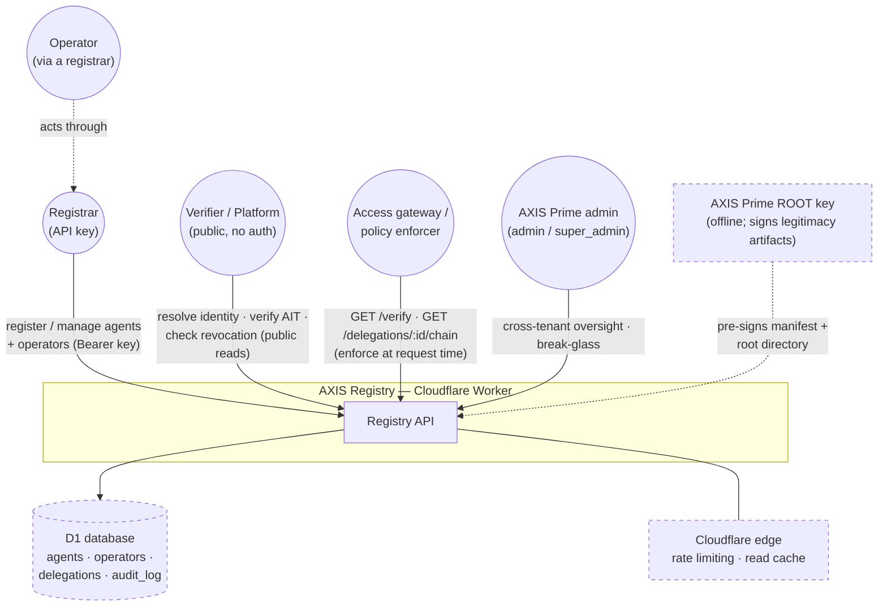
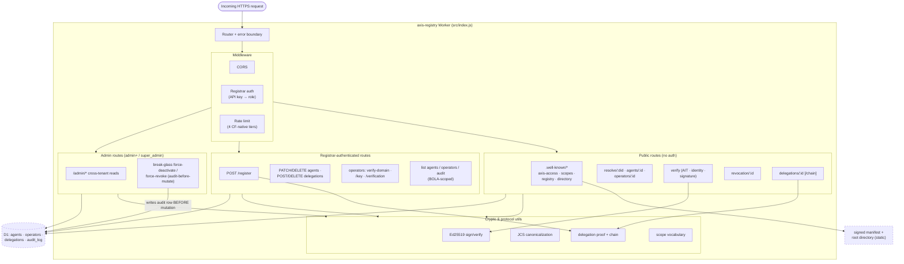

# AXIS Registry — Architecture

**System:** AXIS Registry (the root registry / registry-as-platform)
**Version / date:** As-built, 2026-07-04
**Owner:** AXIS Registry maintainers
**Verified from:** source (`src/index.js`, `src/routes/*`, `src/middleware/*`,
`wrangler.toml`), not design docs.
**Standard:** follows the org [Architecture Diagrams standard](https://c4model.com) (C4 + Mermaid + stability tags).

The registry is the identity system of record for AXIS: registrars register
agents and operators, and anyone can publicly resolve an identity, verify an
AXIS Identity Token (AIT), and check revocation. It is a single stateless
Cloudflare Worker over a D1 (SQLite) database, deployed at
`registry.axisprime.ai`.

**Legend (all diagrams):** `((circle))` = actor · `[rectangle]` = component we
own · `[(cylinder)]` = datastore · dashed = external system · **solid border =
STABLE, dashed border = CHANGING.**

---

## Level 1 — System Context

Who uses the registry and what it depends on.

**Notes**
- Public reads (`resolve`, `verify`, revocation, well-known discovery) require
  **no auth** and are free. Mutations require a registrar API key.
- An **access gateway** is any downstream policy enforcer that verifies AITs and
  walks delegation chains at request time. The registry is the source of truth
  for revocation and keys; **it does not enforce access itself** — enforcement
  lives in the gateways and platforms.
- Legitimacy artifacts (registry self-manifest, Prime root directory) are signed
  **offline** by the Prime ROOT key and served static; verifiers pin the root
  public key.

---

## Level 2 / 3 — Container & Components

The Worker is one deployable. The interesting structure is its internal request
pipeline and route groups.

**Design invariants worth knowing**
- **Auth-before-route:** the registrar is resolved up front so every route can
  gate by role (`null` = anonymous).
- **Rate limiting is tiered** (`PUBLIC_READ`, `PUBLIC_VERIFY_SIG`, `REGISTRAR`,
  `AUTH_FAIL`) via Cloudflare's native rate-limit bindings — defense-in-depth,
  bucketed by registrar id or client IP.
- **Break-glass writes audit first.** `force-*` endpoints insert the audit row
  and abort the mutation if that write fails. `target_registrar_id` is captured
  so an affected registrar sees force-actions on their own resources.
- **Public reads are edge-cached** (`Cache-Control: public, max-age=3600`) *only*
  when unauthenticated; presence of `Authorization`/`?ait=` unlocks a
  presentation layer that varies by caller, so caching is skipped there.
- The registry **verifies** AITs and delegation chains but is **custody-agnostic**
  — it never holds agent or operator private keys.

---

## Data (D1)

Single D1 database. Core tables: `agents`, `operators`, `delegations`,
`audit_log`. Schema and evolution live in `../../migrations/` and
`../../schema.sql`.

## Decisions

Rationale for the above lives in the repo's decision records and `SECURITY.md`.
When you change how the system is wired, update this file in the same PR.
